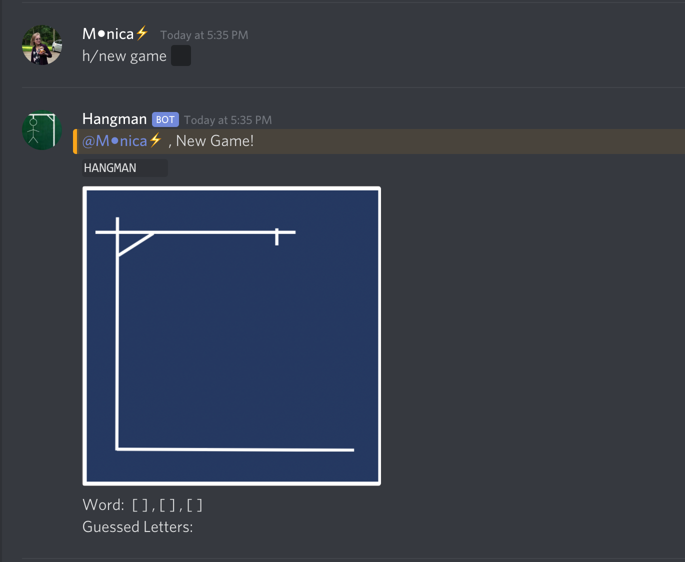

# HangmanBot
A bot on Discord that can ask one user for a word or phrase and have the other users in the server guess before its too late! (or they get 10 wrong guesses)
____________________________________________________________________________________
## Commands:<br/>
To find out what this bot does (and how to play hangman), run the command
```
h/info
``` 

<br/>

## Start game: <br/>
A User inputs a word with the command
```
h/new game ||word or phrase||
``` 
By asking the user to surround the word for others to guess with "||", discord blocks the word from being visable.<br/>
In the example below, game word to guess is "cat":<br/>

<br/>

## Playing Game <br/>
##### Guessing a letter:
After an input of a word for a game, a user can guess a letter with the command
```
h/guess g 
``` 
(example is they are guessing letter g).
This will prompt to outputs, one where g is in the word (like in dog )
- image

Or where g is not in the word (like in cat):

<br/>

##### Asking for a hint:
If stuck, a user can use the following command to get a hint for a letter in the word/phrase:
```
h/hint 
``` 
- image
This takes a hit on the user, where a point is used, just like if they guessed incorrecly. If the user wishes to not play like this, they can use the command:
```
h/hint w/outp
``` 
where no points will get used, and hangman will not be harmed while still getting a letter for the word/phrase.


##### Win/Lose:
If the users succesffuly guess the word/phrase, the end game will look like this:

<br/>

If the users unforntuly do not guess the word/phrase afer a total of 10 inccorect attempts or hints, this is the end game:
- image


## Errors <br/>

<br/>

- repeating a letter guess catch
- guessing without a letter/to many letters

____________________________________________________________________________________
Last update: 12/27/2019