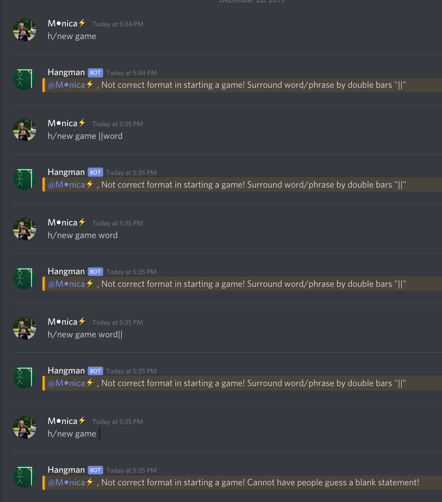

# HangmanBot
A bot on Discord that can ask one user for a word or phrase and have the other users in the server guess before its too late! There can be 10 max hints used/incorrect guesses used before game over.

____________________________________________________________________________________
## Commands:<br/>
To find out what this bot does (how to play hangman), run the command
```
h/info
``` 

<br/>

## Start game: <br/>
A User inputs a word with the command
```
h/new game ||word or phrase||
``` 
By asking the user to surround the word for others to guess with "||", discord blocks the word from being visable.<br/>
<br/>
In the example below, the word to guess is "cat":<br/>

<br/>

## Playing Game <br/>
##### Guessing a letter:
After the input for a word/phrase to guess is given, a user can guess a letter with the command
```
h/guess g 
``` 
(Above, letter g is the letter being guessed).<br/>
<br/>
This will prompt two outputs, one where g is in the word (like in dog):

<br/>

Or where g is not in the word (like in cat):

<br/>

##### Asking for a hint:
If stuck, a user can use the following command to get a hint for a letter in the word/phrase:

```
h/hint 
``` 

<br/>
This takes a hit on the user, where a point is used, just like if they guessed incorrecly. 
If the user wishes to not be penalized for using a hint, they can use the command:

```
h/hint w/outp
```

No points will be deducted, and hangman will not be harmed while still getting a letter for the word/phrase.


##### Game Status:
During the game the user can type the command:
```
h/game status 
``` 
To recieve the number of wrong guesses or hints they have used (out of a max of 10):


##### Win/Lose:
If the users successfully guess the word/phrase, the end game will look like this:

<br/>

If the users do not guess the word/phrase afer a total of 10 incorrect attempts or hints, this is the end game:

<br/>


## Errors <br/>
- Starting a new game


- Repeating a guess (not penalized)


- Incorrect guess format (not penalized)


<br/>

____________________________________________________________________________________
Last update: 12/29/2019